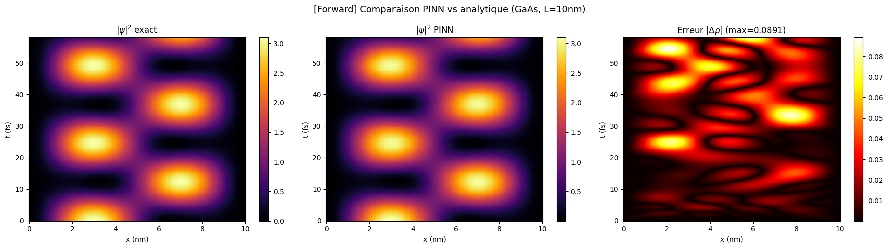
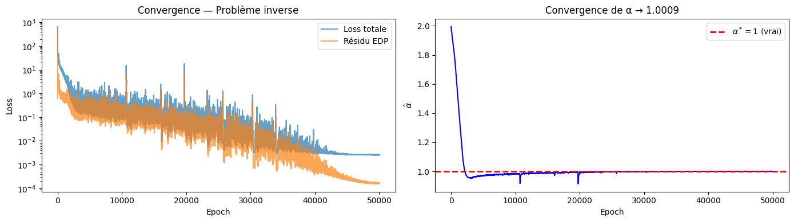

# PINNs pour l'Équation de Schrödinger

**Électron dans un puits quantique GaAs/AlGaAs : problème direct et problème inverse**

> Projet réalisé dans le cadre de l'UE *IA for EE and CS* (E. Aldea) — Master 2 FESup / SIEN, ENS Paris-Saclay.

**Auteurs :** Gatien Séguy & Sofiane Boucherba

---

## Contexte physique

On considère un électron confiné dans un puits quantique infini de GaAs/AlGaAs de largeur $L = 10\,\text{nm}$. La dynamique est régie par l'équation de Schrödinger dépendante du temps (1D) :

$$i\hbar\,\frac{\partial \psi}{\partial t} = -\frac{\hbar^2}{2m^*}\frac{\partial^2 \psi}{\partial x^2}$$

avec $m^* = 0.067\,m_e$ la masse effective de l'électron dans GaAs [1].

Après adimensionnement ($E_0 = \hbar^2/(m^*L^2) \approx 11.4\,\text{meV}$, $t_0 = m^*L^2/\hbar \approx 58\,\text{fs}$), l'EDP se réduit à :

$$i\,\partial_t\psi = -\frac{1}{2}\partial_{xx}\psi$$

La condition initiale est une superposition des deux premiers modes propres $\psi(x,0) = \frac{1}{\sqrt{2}}[\phi_1(x) + \phi_2(x)]$, dont la solution analytique exacte est connue [2] et sert de vérité terrain.

## Objectifs du projet

1. **Problème direct** — Résoudre l'EDP de Schrödinger avec un PINN et comparer à la solution analytique.
2. **Problème inverse** — Retrouver la masse effective $m^*$ à partir de mesures bruitées de $|\psi|^2$, en apprenant un paramètre $\alpha = m_0^*/m_{\text{vrai}}^*$ conjointement avec les poids du réseau.

## Architecture du PINN

| Composant | Description |
|---|---|
| Entrée | $(\tilde{x}, \tilde{t}) \in [0,1] \times [0,T]$ |
| Réseau | 4 couches cachées, 64 neurones/couche, activation $\tanh$ |
| Sortie | $(u, v) = (\text{Re}\,\psi, \text{Im}\,\psi) \in \mathbb{R}^2$ |
| Loss | Résidu EDP + CI + CL ($\lambda_f = 1$, $\lambda_{\text{IC}} = \lambda_{\text{BC}} = 20$) |
| Optimiseur | Adam, lr $= 5 \times 10^{-3}$, scheduler StepLR ($\times 0.5$ / 2000 steps) |

Pour le problème inverse, un terme d'attache aux données $\lambda_d \sum \| |\psi_\omega|^2 - |\psi_{\text{data}}|^2 \|^2$ est ajouté, et $\alpha$ est un `torch.nn.Parameter` optimisé conjointement.

## Résultats principaux

### Problème direct (100 000 époques, $T = 1$, soit $\sim 58\,\text{fs}$)

- Erreur maximale sur $|\psi|^2$ : $\max|\Delta\rho| \approx 0.089$
- Conservation de la norme : dérive de $\sim 2\%$ sur le domaine temporel (non imposée dans la loss)

### Problème inverse (50 000 époques, $N_d = 100$ capteurs, $\sigma_b = 0.02$)

- Initialisation : $\alpha_0 = 2.0$ (soit $m_0^* \approx 0.034\,m_e$, erreur de $\sim 50\%$)
- Résultat : $\hat{\alpha} \to 1.0009$, soit $\hat{m}^* \approx 0.067\,m_e$ (erreur $< 0.1\%$)

## Références

[1] I. Vurgaftman, J. R. Meyer, and L. R. Ram-Mohan, *Band parameters for III–V compound semiconductors and their alloys*, J. Appl. Phys. **89**(11), 5815–5875 (2001). [DOI: 10.1063/1.1368156](https://doi.org/10.1063/1.1368156)

[2] D. J. Griffiths and D. F. Schroeter, *Introduction to Quantum Mechanics*, 3rd ed., Cambridge University Press, 2018.
